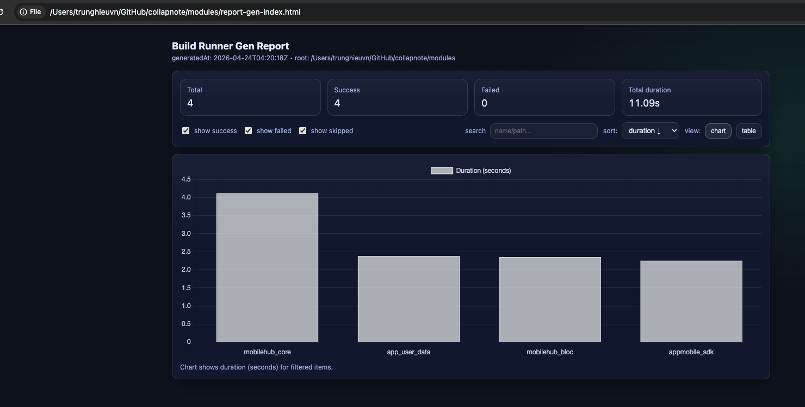
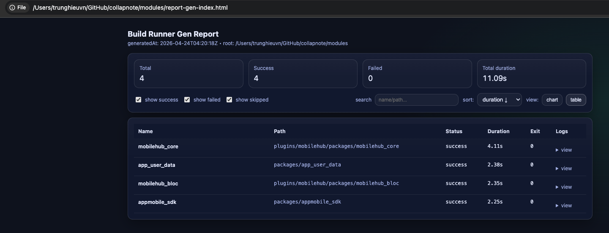

Script generate build_runner report times build
Report times run for dart, Flutter project

  - https://pub.dev/packages/build_runner

# How to use
Copy script to your project/workspace: `report_runner.sh` and run 
```bash
sh report_runner.sh
```


After running finish, auto open html page to View report:


